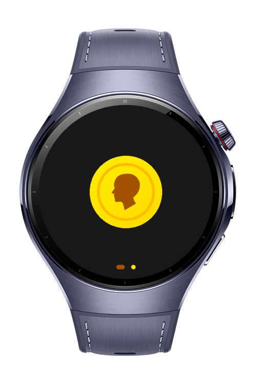
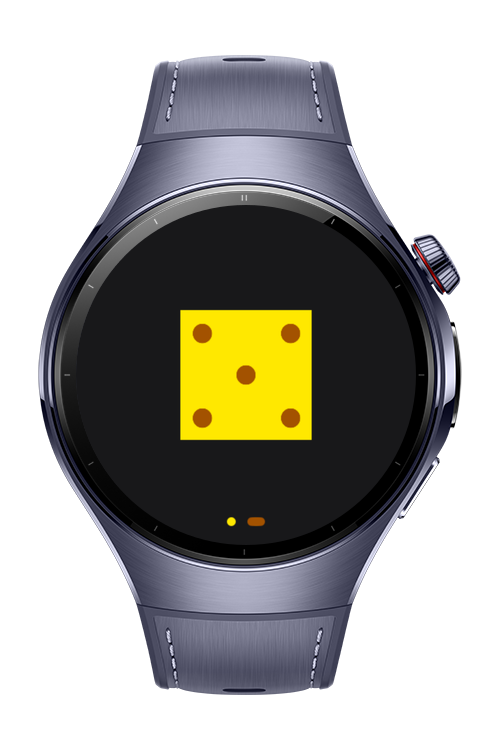

> **Note:** To access all shared projects, get information about environment setup, and view other guides, please visit [Explore-In-HMOS-Wearable Index](https://github.com/Explore-In-HMOS-Wearable/hmos-index).

# Coin Flip & Dice Rolling

This sample app demonstrates how lightweight utility apps can combine randomness with animation to create engaging user
experiences. Through simple interactions like coin flips and dice rolls, it highlights the integration of Lottie animations with minimal UI logic. The goal is to showcase how randomization and smooth visual effects can be applied to deliver instant, interactive, and entertaining results.

# Preview

<div>
  
  
  
</div>

# Use Cases

- Make quick yes/no decisions with a coin flip
- Roll dice for games or fun
- Demo randomization and animations in apps

# Tech Stack

- **Languages**: ArkTS, Typescript
- **Frameworks**: HarmonyOS SDK 5.1.0(18)
- **Tools**: DevEco Studio Version 5.1.0.828
- **Libraries**:
    - `@kit.AbilityKit`
    - `@kit.ArkUI`
    - `@kit.PerformanceAnalysisKit`
    - `@ohos/lottie`

# Project Directory

```
├──entry/src/main/ets/
│  ├──common                            // lottie JSON animation files
│  ├──components                        // Reusable UI Components
│  ├──entryability
│  │   └──EntryAbility.ets              // Entry ability lifecycle callbacks
│  ├──entrybackupability
│  │   └──EntryBackupAbility.ets        // EntryBackupAbility lifecycle callbacks
│  ├──pages                             // Pages
│  └──utils
│      └──Logger.ets                    // Logging utility
└──entry/src/main/resources             // Static resources
```

# Constraints and Restrictions

## Supported Devices

- Huawei Watch 5

# LICENSE

**Coin Flip & Dice Rolling** is distributed under the terms of the MIT License.
See the [license](/LICENSE) for more information.